# Windows 11 Endpoint Management with Microsoft Intune and Windows Autopilot

## Overview

This project demonstrates an end-to-end Windows 11 endpoint management lab using Microsoft Intune, Microsoft Entra ID, Windows Autopilot, Microsoft Defender, BitLocker, Windows LAPS, compliance policies, and device-side validation.

The lab was designed to simulate a modern cloud-managed Windows endpoint lifecycle: registering a device with Autopilot, provisioning it through OOBE, joining it to Microsoft Entra ID, enrolling it into Intune, applying security and configuration policies, validating those controls directly on the endpoint, and troubleshooting a failed deployment through root-cause analysis and remediation.

The managed endpoint is a Windows 11 virtual machine running in Hyper-V.

---

## Skills Demonstrated

- Microsoft Intune administration
- Microsoft Entra ID device join and identity validation
- Windows Autopilot registration and user-driven deployment
- Enrollment Status Page configuration
- Intune Management Extension validation
- Settings Catalog policy deployment
- Windows compliance policy configuration and remediation
- Microsoft Defender Antivirus management
- Microsoft Defender Firewall management
- Attack Surface Reduction rule deployment
- BitLocker encryption and recovery key escrow
- Windows LAPS configuration and password escrow
- TPM and Secure Boot validation
- PowerShell-based endpoint validation
- Event Viewer and MDM diagnostics
- Policy troubleshooting and root-cause analysis

---

## Technologies Used

| Technology | Purpose |
|---|---|
| Microsoft Intune | Endpoint management, policy deployment, compliance, and remote actions |
| Microsoft Entra ID | Cloud identity and device join |
| Windows Autopilot | Automated Windows provisioning |
| Windows 11 | Managed endpoint operating system |
| Microsoft Defender | Antivirus, security intelligence, and endpoint protection |
| Microsoft Defender Firewall | Host firewall enforcement |
| Attack Surface Reduction | Endpoint hardening |
| BitLocker | Full-volume encryption and recovery key escrow |
| Windows LAPS | Local administrator password management |
| PowerShell | Validation, diagnostics, and troubleshooting |
| Hyper-V | Virtualized Windows 11 test endpoint |

---

## Lab Architecture

```text
Microsoft Entra ID
        │
        ▼
Microsoft Intune
        │
        ├── Windows Autopilot
        ├── Configuration Profiles
        ├── Compliance Policies
        ├── Defender / Firewall / ASR
        ├── BitLocker
        └── Windows LAPS
        │
        ▼
Windows 11 Hyper-V Endpoint
        │
        ├── Microsoft Entra Joined
        ├── Intune Enrolled
        ├── Intune Management Extension
        └── Device-side validation with PowerShell
```

---

## End-to-End Deployment Workflow

The completed workflow was:

**Hardware Hash Collection → Autopilot Registration → Profile Assignment → OOBE Sign-In → Enrollment Status Page → Microsoft Entra Join → Intune Enrollment → Security Policy Deployment → Compliance Evaluation → Remediation → Validation**

---

## 1. Windows Autopilot Registration

The Windows 11 virtual machine was registered with Windows Autopilot by collecting its hardware hash and importing the resulting CSV into Microsoft Intune.

The workflow included:

- Capturing the Windows Autopilot hardware hash
- Importing the hardware information into Intune
- Confirming the device appeared under Windows Autopilot devices
- Creating a user-driven deployment profile
- Configuring Microsoft Entra joined deployment
- Assigning the deployment profile to the device
- Confirming the Autopilot profile status was **Assigned**

### User-driven deployment profile

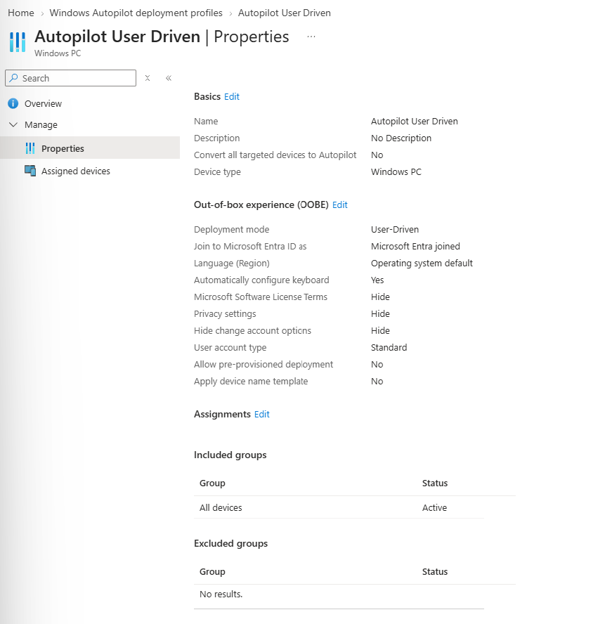

---

## 2. Enrollment Status Page and Successful Provisioning

The Enrollment Status Page was configured to display device provisioning progress and block device use while required device configuration was being applied.

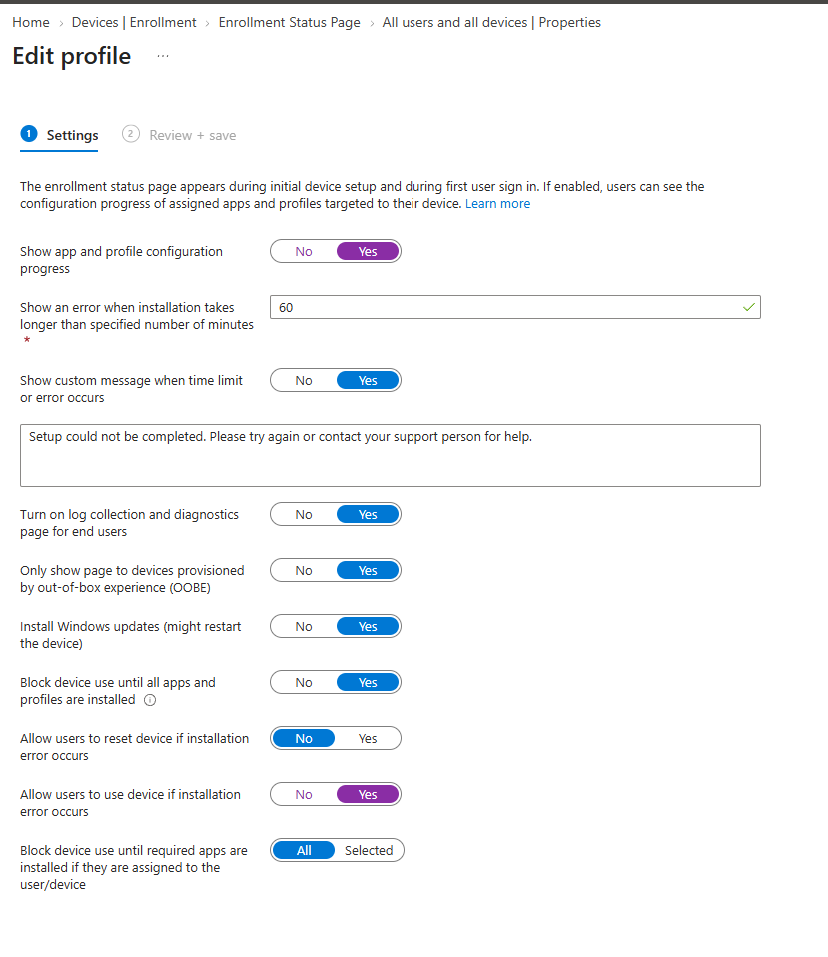

The successful deployment reached the Windows Autopilot Enrollment Status Page and completed the critical provisioning stages:

- **Device preparation — Completed**
- **Device setup — Completed**
- Device continued successfully to the Windows desktop

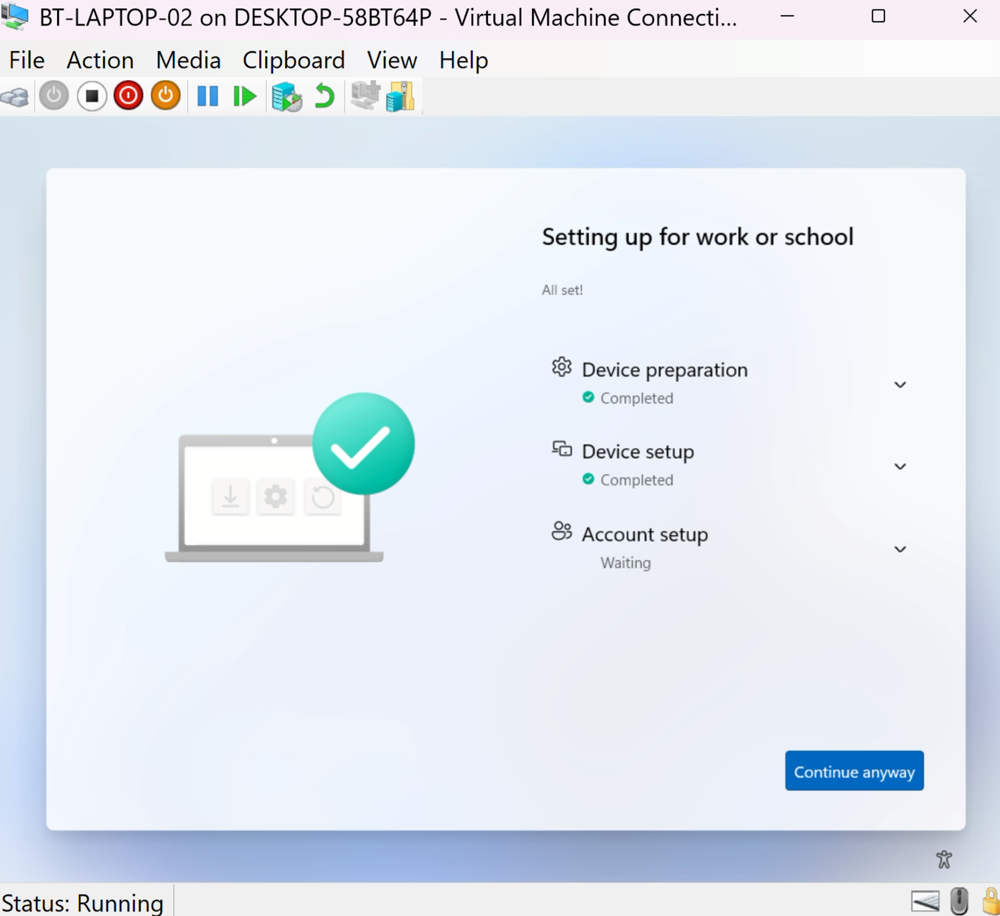

This confirmed that the rebuilt endpoint could complete the provisioning flow after the earlier deployment issue had been remediated.

---

## 3. Microsoft Entra Join and Intune Enrollment

After Autopilot provisioning, the Windows 11 endpoint successfully joined Microsoft Entra ID and enrolled into Microsoft Intune.

Device-side validation with `dsregcmd /status` confirmed Microsoft Entra join state on the endpoint.

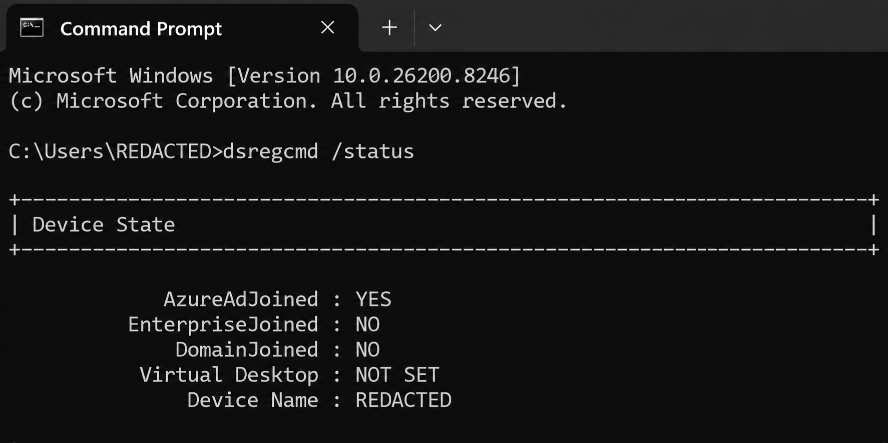

This validated that the endpoint was cloud joined rather than traditional Active Directory domain joined.

---

## 4. Intune Management Extension Validation

A key validation point in this project was confirming that the Microsoft Intune Management Extension was installed and functioning correctly after the successful rebuild.

The Windows work/school management page showed centrally applied policy categories including ADMX / Windows Explorer, BitLocker, Defender, Device Lock, Security, and System.

The Microsoft Intune Management Extension application status reported **EnforcementCompleted**, providing direct evidence that the management extension was successfully installed and processing policy.

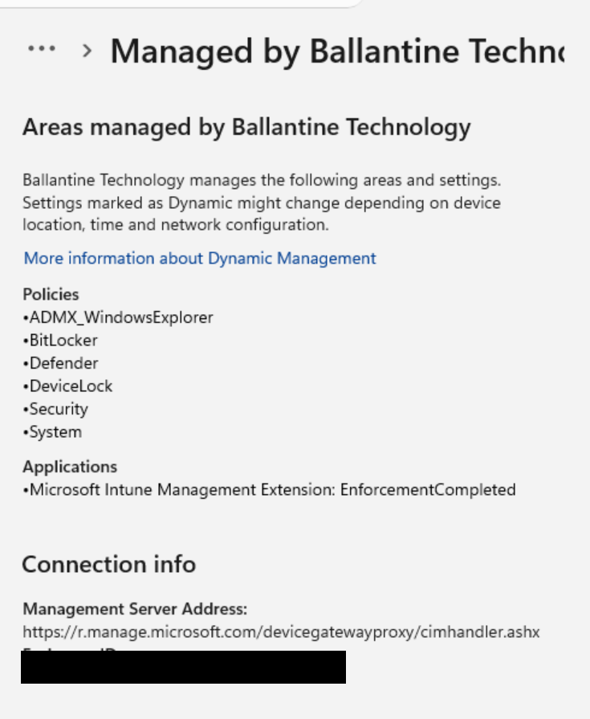

This is especially important because the earlier failed endpoint had not successfully established the expected IME state.

---

## 5. Security and Configuration Policies

The lab includes multiple Windows configuration and endpoint security policies deployed through Intune.

### Device Configuration

A Windows 11 device configuration profile was created with Device Lock controls including:

| Setting | Configuration |
|---|---|
| Device Password Enabled | Enabled |
| Allow Simple Device Password | Not allowed |
| Maximum Password Failed Attempts | 10 |
| Maximum Inactivity Time Device Lock | 15 minutes |
| Minimum Device Password Length | 8 |

### Microsoft Defender Firewall

Firewall policy was deployed and validated with PowerShell. Domain, Private, and Public firewall profiles reported as enabled.

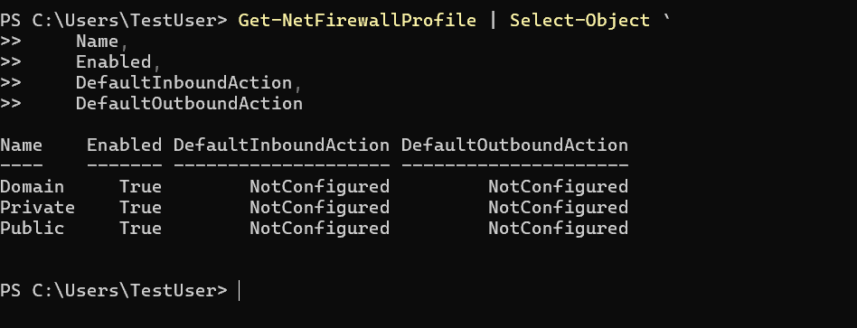

### Attack Surface Reduction

Attack Surface Reduction rules were deployed through Intune and verified from PowerShell by reviewing the configured ASR rule IDs and actions.

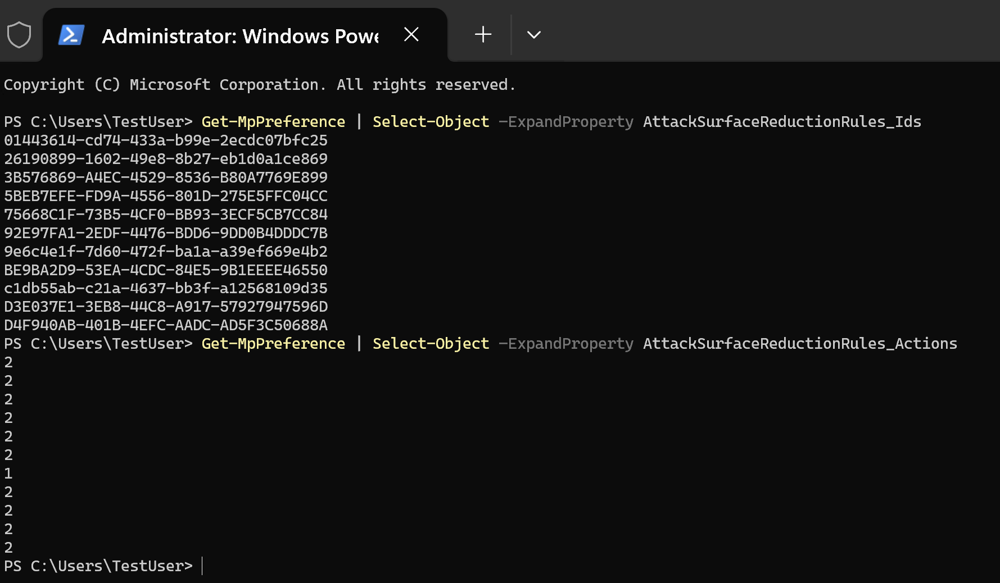

### Security Baseline / SmartScreen

Microsoft Defender SmartScreen remained enabled as part of the Windows security configuration.

---

## 6. BitLocker

BitLocker was successfully deployed and validated as part of the endpoint security configuration.

The project demonstrates centralized BitLocker policy deployment, endpoint-side encryption validation, compliance reporting, and recovery key escrow.

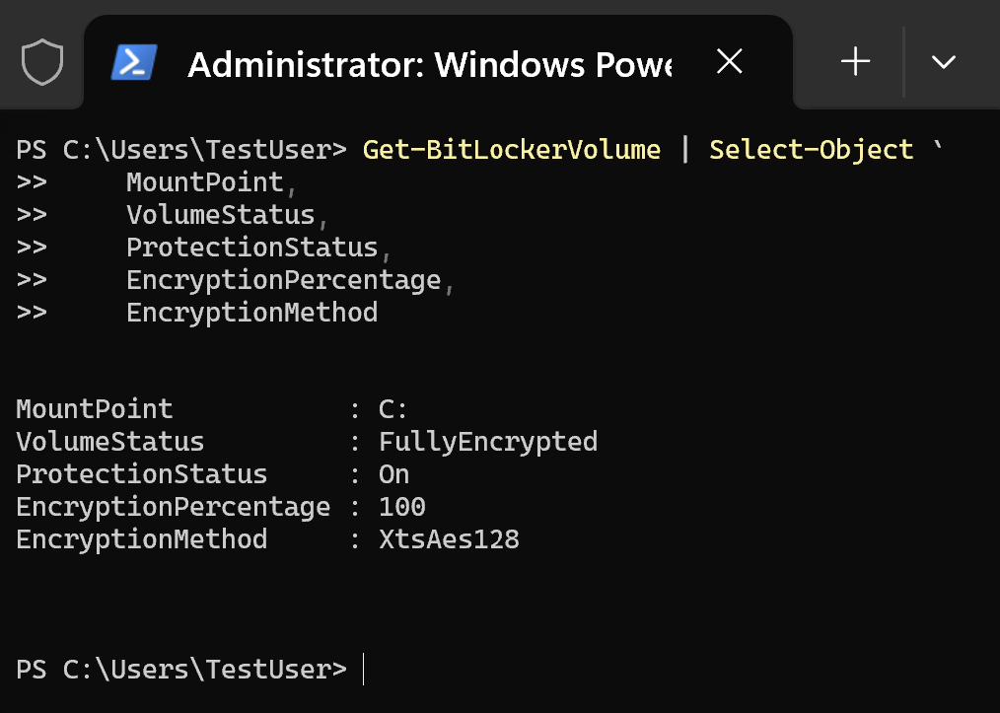

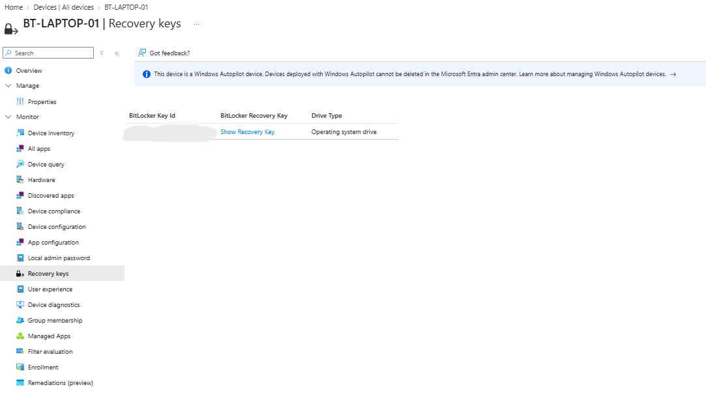

> **Security Note:** Recovery passwords are not published in this repository.

---

## 7. Windows LAPS

Windows Local Administrator Password Solution was configured through Intune.

The lab demonstrates policy assignment, successful policy application, local administrator password escrow, rotation information, and the administrative retrieval workflow.

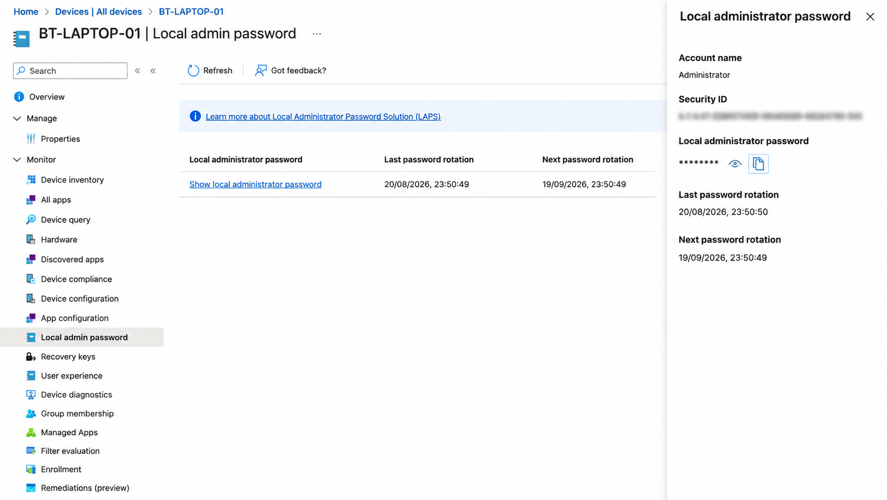

> **Security Note:** LAPS passwords are masked or redacted in all public evidence.

---

## 8. Compliance Policy and Remediation

A Windows compliance policy was used to evaluate endpoint security requirements including Firewall, Anti-spyware, Antivirus, BitLocker, Microsoft Defender Antimalware, Real-time protection, Secure Boot, Defender security intelligence currency, and TPM.

A completed compliance evaluation showed all configured checks compliant.

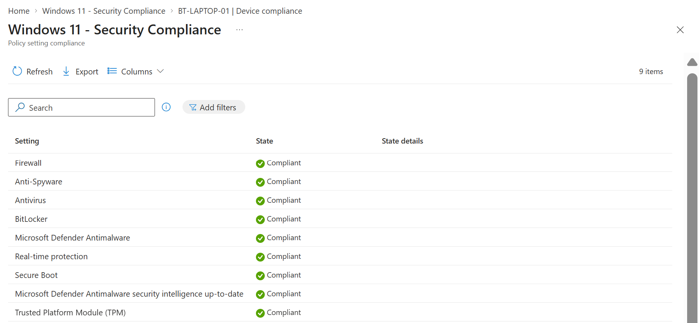

During validation of the rebuilt endpoint, Microsoft Defender security intelligence was initially not current. Rather than weakening the compliance policy, the issue was remediated through the Intune device action **Update Windows Defender security intelligence**.

The remote action completed successfully, the device checked in again, and the device returned to **Compliant** status.

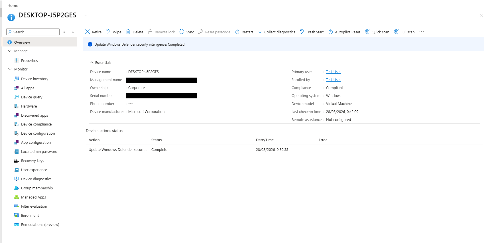

This demonstrates both compliance evaluation and operational remediation through Intune.

---

## 9. Device-Side Validation

Portal status alone was not treated as sufficient evidence of successful policy deployment. The project also validates controls directly from Windows using `dsregcmd`, PowerShell, TPM and Secure Boot checks, BitLocker status, Defender/Firewall cmdlets, work/school management information, Event Viewer, and MDM diagnostic logs.

This provides evidence that configured Intune policies actually reached and affected the endpoint.

---

## 10. Troubleshooting: Autopilot / IME Failure

The most valuable part of the project was troubleshooting an earlier Windows Autopilot deployment failure.

### Symptoms

The original endpoint repeatedly failed during the Autopilot Enrollment Status Page while preparing the device for mobile management.

The Autopilot deployments report confirmed the failed user-driven deployment.

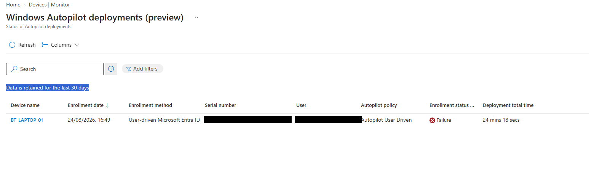

Troubleshooting also showed that the expected Intune Management Extension installation state was absent from the endpoint.

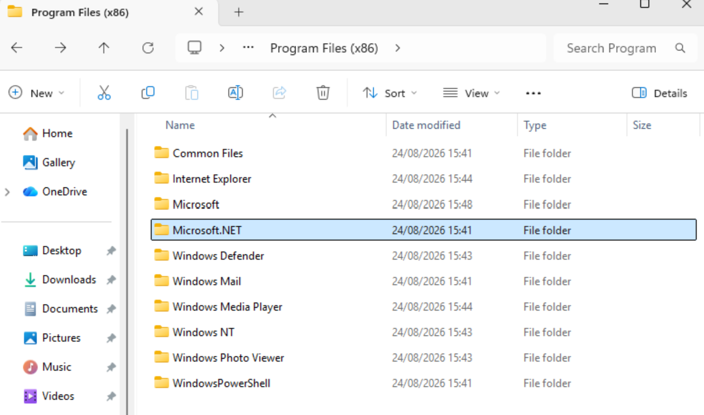

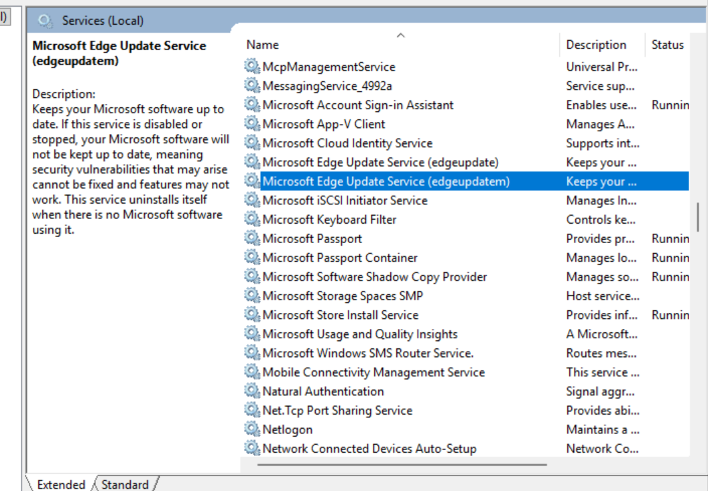

MDM diagnostic logs then provided additional technical evidence through Event ID 404 and ADMXInstall failures.

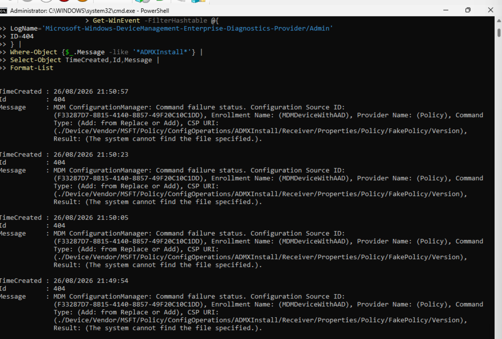

### Root Cause Investigation

Registry inspection identified:

```text
HKLM\SOFTWARE\Policies\Microsoft\Windows\Installer
DisableMSI = 2
```

The Intune Windows security configuration contained Windows Installer restrictions equivalent to disabling Windows Installer **Always**. This policy was identified as a likely blocker for Intune Management Extension installation and processing.

### Remediation

The Windows Installer restriction was removed from the Intune security configuration while retaining the intended SmartScreen security setting.

A clean Windows 11 VM was then created to remove stale local policy state. Before enrollment, the rebuilt device was checked for the previous registry restriction and the `DisableMSI` registry value was no longer present.

The new device was registered with Windows Autopilot and provisioned again.

### Result

The rebuilt endpoint successfully completed Autopilot device preparation and device setup, reached the desktop, joined Microsoft Entra ID, enrolled into Intune, installed the Intune Management Extension, reported **EnforcementCompleted**, applied security/configuration policies, and reached **Compliant** status.

The troubleshooting workflow can be summarized as:

**Deployment Failure → Sidecar / IME Investigation → Missing IME State → Event 404 / ADMX Errors → Windows Installer Restriction Identified → Policy Corrected → Clean Rebuild → Successful Autopilot Provisioning → IME Functional → Device Compliant**

---

## Evidence Structure

```text
images/
├── autopilot/
├── security/
├── compliance/
├── bitlocker/
├── laps/
├── validation/
└── troubleshooting/
```

Selected screenshots are used rather than publishing every captured image. The goal is to provide enough evidence to demonstrate each stage while keeping the repository concise and readable.

---

## Project Status

- [x] Windows 11 Hyper-V endpoint deployed
- [x] Microsoft Entra ID integration
- [x] Microsoft Intune enrollment
- [x] Windows Autopilot hardware hash registration
- [x] Autopilot user-driven deployment profile
- [x] Enrollment Status Page configuration
- [x] Successful Autopilot provisioning
- [x] Microsoft Entra join validation
- [x] Intune Management Extension validation
- [x] Windows device configuration policy
- [x] Microsoft Defender Antivirus policy
- [x] Microsoft Defender Firewall policy
- [x] Attack Surface Reduction rules
- [x] BitLocker policy and encryption validation
- [x] BitLocker recovery key escrow
- [x] Windows LAPS configuration and password escrow
- [x] Windows compliance policy
- [x] Defender security intelligence remediation through Intune
- [x] Final compliant device state
- [x] PowerShell-based device validation
- [x] Autopilot / IME troubleshooting and root-cause remediation

---

## Security and Privacy

Screenshots are reviewed before publication. Sensitive or unnecessary environment-specific data is masked or redacted where appropriate, including user email addresses / UPNs, tenant identifiers, unnecessary device identifiers, serial numbers, BitLocker recovery passwords, Windows LAPS passwords, authentication tokens, secrets, and credentials.

Technical evidence such as policy names, event IDs, compliance results, PowerShell output, configuration state, and troubleshooting details is intentionally retained where it does not expose sensitive information.

---

## Key Takeaways

This project demonstrates more than simply creating Intune policies. It covers the full cloud endpoint lifecycle and validates the result from both the administration portal and the Windows endpoint.

The strongest outcome of the lab was diagnosing a failed Autopilot deployment, tracing the issue through registry state and MDM diagnostics, identifying a Windows Installer restriction that interfered with the management extension, correcting the configuration, rebuilding the endpoint, and proving successful deployment and compliance afterward.

The project therefore demonstrates practical skills relevant to endpoint administration, infrastructure support, systems administration, and modern workplace engineering roles.

---

## Disclaimer

This project was created in a lab environment for educational and portfolio purposes. It does not represent a production Microsoft Intune deployment. Configuration decisions were made to demonstrate endpoint management, security, compliance, provisioning, and troubleshooting concepts in a controlled environment.
