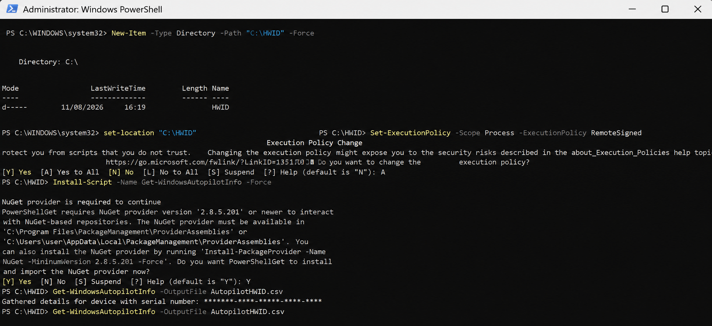
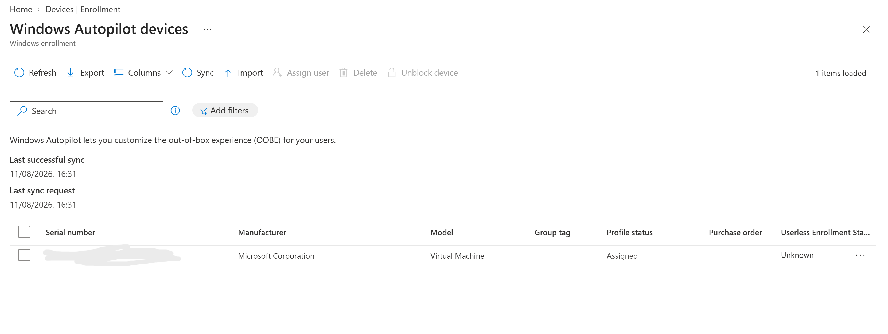
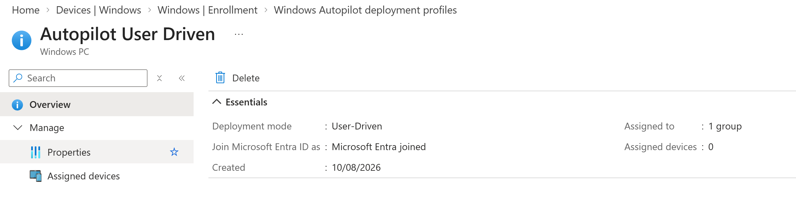
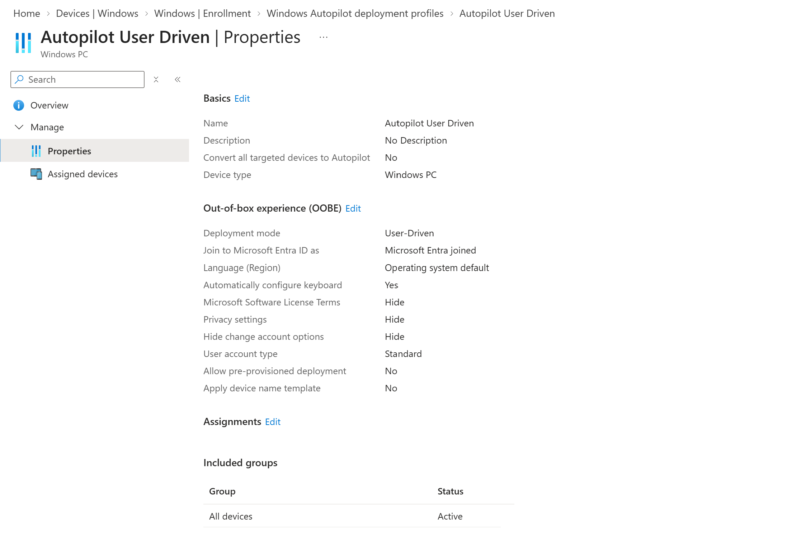
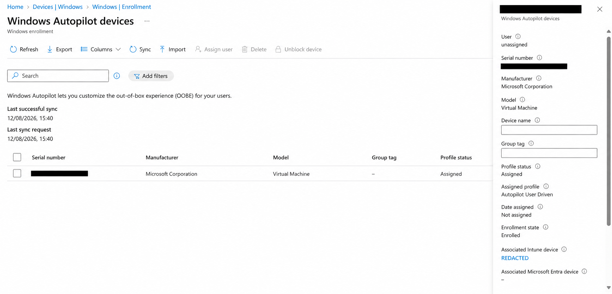

# Windows 11 Endpoint Management with Microsoft Intune

## Overview

This project demonstrates the deployment, configuration, and security management of a Windows 11 endpoint using Microsoft Intune, Microsoft Entra ID, and Windows Autopilot.

The environment was built as a practical cloud endpoint management lab to demonstrate how Windows devices can be provisioned, configured, secured, and monitored from Microsoft Intune.

A Windows 11 virtual machine is used as the managed endpoint, with policies deployed centrally through Intune and validated directly on the device.

---

## Project Objectives

The project demonstrates practical experience with:

- Microsoft Intune endpoint management
- Microsoft Entra ID device identity
- Windows Autopilot
- Windows 11 device enrollment
- Configuration profiles
- Settings Catalog policies
- Device security controls
- Compliance policies
- BitLocker encryption
- BitLocker recovery key escrow
- Policy assignment and synchronization
- PowerShell-based device validation

---

## Technologies Used

| Technology | Purpose |
|---|---|
| Microsoft Intune | Endpoint management and policy deployment |
| Microsoft Entra ID | Identity and device management |
| Windows Autopilot | Automated Windows provisioning |
| Windows 11 | Managed endpoint |
| BitLocker | Full-volume disk encryption |
| PowerShell | Device-side validation and troubleshooting |
| Virtual Machine | Windows 11 test endpoint |

---

## Architecture

The lab follows a cloud-managed Windows endpoint model:

```text
Microsoft Entra ID
        │
        ▼
Microsoft Intune
        │
        ▼
Windows Autopilot
        │
        ▼
Windows 11 Endpoint
        │
        ├── Configuration Policies
        ├── Compliance Policies
        ├── Security Controls
        └── BitLocker Encryption
```

---

## Windows Autopilot

The Windows 11 virtual machine was registered with Windows Autopilot and managed through Microsoft Intune.

The Autopilot workflow included collecting the device hardware hash, importing the device into Intune, confirming registration, creating a user-driven deployment profile, and assigning the profile.

### 1. Hardware Hash Collection

The Windows Autopilot hardware hash was collected from the Windows 11 endpoint using PowerShell and the `Get-WindowsAutopilotInfo` script.



### 2. Hardware Hash Import

The collected hardware information was imported into the Windows Autopilot devices section of Microsoft Intune.



### 3. Device Registration

After synchronization, the device appeared in Windows Autopilot, confirming successful registration.



### 4. User-Driven Deployment Profile

A user-driven Windows Autopilot deployment profile was configured.

The deployment configuration included:

- User-driven deployment mode
- Microsoft Entra joined deployment
- Standard user account
- Automatic keyboard configuration
- Microsoft Software License Terms hidden
- Privacy settings hidden
- Account change options hidden



### 5. Profile Assignment

The Windows Autopilot deployment profile was assigned to the target devices through Microsoft Intune.



### Autopilot Result

The Windows endpoint was successfully registered with Windows Autopilot and assigned a user-driven deployment profile for Microsoft Entra ID joined deployment.

The completed workflow demonstrates:

**Hardware Hash Collection → Hardware Hash Import → Device Registration → Deployment Profile Configuration → Profile Assignment**

---

## Windows Security Baseline Configuration

A Windows configuration profile was created using the Intune Settings Catalog.

Security-related settings configured included:

### Microsoft Defender SmartScreen

- Configure Windows Defender SmartScreen: **Enabled**
- SmartScreen behaviour: **Warn and prevent bypass**

### Windows Installer

- Turn off Windows Installer: **Enabled**
- Disable Windows Installer: **Always**

These controls demonstrate centralized enforcement of Windows security configuration through Microsoft Intune.

---

## Windows 11 Device Configuration

A separate configuration profile was created to demonstrate endpoint configuration management.

**Policy Name:** `Windows 11 - Device Configuration`

Device Lock settings were configured including:

| Setting | Configuration |
|---|---|
| Device Password Enabled | Enabled |
| Allow Simple Device Password | Not allowed |
| Maximum Password Failed Attempts | 10 |
| Maximum Inactivity Time Device Lock | 15 minutes |
| Minimum Device Password Length | 8 |

The policy was assigned to managed Windows devices through Microsoft Intune.

---

## Compliance Policy

A Windows compliance policy will be used to evaluate endpoint security requirements including:

- BitLocker
- Secure Boot
- Trusted Platform Module (TPM)
- Device security state

The compliance state will be validated from both Microsoft Intune and the Windows endpoint.

---

## BitLocker

BitLocker will be deployed and managed through Microsoft Intune.

The project will demonstrate:

- Centralized BitLocker policy deployment
- Windows drive encryption
- Encryption status validation
- Recovery key backup to Microsoft Entra ID
- Recovery key visibility from Intune

> **Security Note:** BitLocker recovery keys and other sensitive information will be redacted from screenshots before publication.

---

## Device-Side Validation

Policies will not be considered successfully deployed based solely on the Intune admin center reporting a successful status.

Windows and PowerShell will also be used to validate configuration directly from the managed endpoint.

Validation will include areas such as:

- Microsoft Entra join status
- Intune MDM enrollment
- Policy synchronization
- BitLocker encryption status
- TPM status
- Secure Boot
- Applied configuration

This provides evidence that the policies configured in Intune actually reached and affected the endpoint.

---

## Project Progress

- [x] Windows 11 virtual machine deployed
- [x] Microsoft Entra ID integration
- [x] Microsoft Intune enrollment
- [x] Windows Autopilot registration
- [x] Autopilot deployment profile
- [x] Windows security configuration
- [x] Windows device configuration policy
- [ ] Windows compliance policy
- [ ] BitLocker policy
- [ ] BitLocker recovery key escrow
- [ ] Device-side validation
- [ ] Final Intune validation

---

## Repository Structure

```text
Microsoft-Intune-Autopilot-Lab/
│
├── README.md
│
├── docs/
│   ├── 01-environment-overview.md
│   ├── 02-autopilot-deployment.md
│   ├── 03-device-configuration.md
│   ├── 04-compliance-policy.md
│   ├── 05-bitlocker.md
│   └── 06-validation.md
│
└── images/
    ├── autopilot/
    │   ├── 09-Autopilot-Hardware-Hash-Captured.png
    │   ├── 10-Autopilot-Hardware-Hash-Import.png
    │   ├── 11-Autopilot-Device-Registered.png
    │   ├── 11.1-Autopilot-User-Driven-Profile-Configuration.png
    │   └── 11.2-Autopilot-Profile-Assigned-to-Device.png
    │
    ├── configuration/
    ├── compliance/
    ├── bitlocker/
    └── validation/
```

---

## Key Takeaways

This project demonstrates hands-on experience managing the Windows endpoint lifecycle using Microsoft's cloud endpoint management technologies.

The lab covers device registration, Windows Autopilot provisioning, Microsoft Intune enrollment, configuration management, security policy enforcement, compliance evaluation, encryption, and endpoint validation.

A key focus of the project is verifying security controls directly from the Windows endpoint rather than relying exclusively on management portal status.

The Windows Autopilot portion of the project demonstrates the process of capturing device hardware information, registering a device with Autopilot, configuring a deployment profile, and assigning that profile through Microsoft Intune.

---

## Security and Privacy

Screenshots used in this repository are reviewed before publication.

Sensitive information such as the following is redacted where necessary:

- Tenant IDs
- Usernames and email addresses
- Device identifiers
- Serial numbers
- Recovery keys
- Authentication information
- Other environment-specific identifiers

---

## Disclaimer

This project was created in a lab environment for educational and portfolio purposes.

The environment does not represent a production Microsoft Intune deployment. Configuration choices were made to demonstrate endpoint management concepts and practical administration skills.
